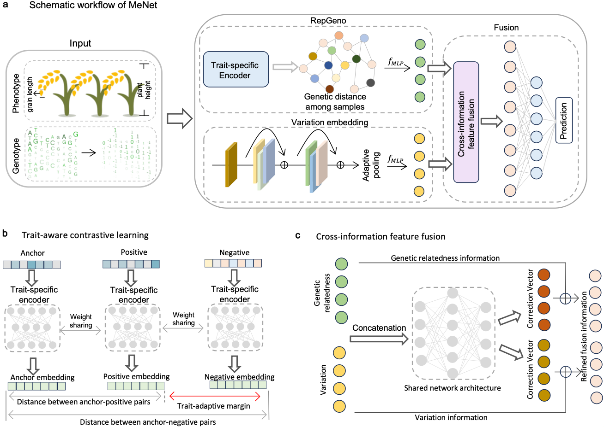

### MeNet

MeNet is a mixed-effects deep neural network architecture for multi-environment agronomic traits prediction. This repository includes model deployment, training steps, prediction steps, and model parameter settings.



### Set up

Set up environments using the following command:

```python
conda create -n MeNet python=3.9.17
conda activate MeNet
conda install pytorch==2.0.0 torchvision==0.15.0 torchaudio==2.0.0 pytorch-cuda=11.8 -c pytorch -c nvidia
pip install -r requirements.txt 
```

### Data Preparation

- The genotype data and phenotype datasets should be in a data folder, organizing as follows:

  ```python
  + data
      + gene
      	++ genotype.csv
      + phen 
       	++ phenotype.csv
      + splits
      	
  ```

  


### RepGeno to generate genetic relatedness

- To generate genetic relatedness, train the trait specific encoder of the RepGeno. The resulting genetic relatedness is then saved in `save/genetic_relatedness.csv`.

  ```python
  python train_trait_specific_encoder.py [parameters]
  
  [parameters]:
      -m --margin      # Contrastive loss margin (distance threshold)
      -p --phen_name   # Name of the target phenotype
      -d --device      # Device to use: 'cuda' or 'cpu'
      -f --flag				 #  Sampling mode: 0 for trait-based, 1 for population-based positive/negative pairs
  ```
  
  The parameter settings are provided in [`configs/contrastive_learning.json`](configs/contrastive_learning.json). The constructed genetic relatedness will have a significant impact on the prediction performance of MeNet.
  
  

### Train MeNet and analyze the contribution between VE and RepGenp

- To train the MeNet model and evaluate the contributions of the VE and RepGeno modules, use the following command. The error tracking results during training and the contributions of the VE and RepGeno modules will be saved in `menet.log`

  ```python
  python menet.py [parameters] > menet.log 
  
  [parameters]:
      -p --phen_name   # Name of the target phenotype
      -w --windows   # Windows mechanism 0: don't use windows_mechanism, 1: windows_mechanism by chromosome
      -d --device      # Device to use: 'cuda' or 'cpu'
  ```

​	The parameter settings are provided in [`configs/MeNet.json`](configs/MeNet.json). 


### Transfer Learning

- To apply transfer learning, you can fine-tune a pre-trained model by selectively freezing and unfreezing specific layers. The following code snippet demonstrates how to configure the model after loading a pre-trained model:

  ```python
  # Freeze all parameters in the model
  for param in model.parameters():
      param.requires_grad = False
      
  # Unfreeze 
  for param in model.fusion.field_for_ve.parameters():
      param.requires_grad = True
  for param in model.fusion.output.parameters():
      param.requires_grad = True
  ```
  
  ##### Explanation
  
  - **Freezing the model**: Setting `requires_grad = False` for all parameters prevents them from being updated during training, preserving the pre-trained weights.
  - **Selective unfreezing**: Specific layers are set to `requires_grad = True` to allow fine-tuning.
  - Ensure the pre-trained model is loaded before applying these settings.

### Acknowledgements

This work is based on [pytorch](https://pytorch.org/) ,  [scikit-learn](https://scikit-learn.org/),  and [plink](https://www.cog-genomics.org/plink/). The project is developed by following author and supervised by Prof. Xiangchao Gan(gan@njau.edu.cn)

Authors:

Yanhui Li  (huiyl@stu.njau.edu.cn): prototype development, data processing, model validation 

Shengjie Ren (sunflower@stu.njau.edu.cn): overall framework design, contrastive learning strategy design, feature fusion mechanism, model architecture formulation, and interpretability and weight contribution analysis

